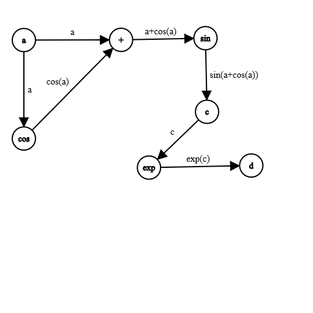
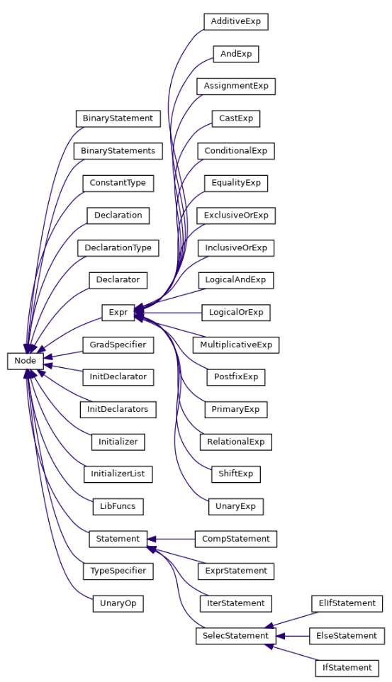

# Nabla

[](https://github.com/IITH-COMPILERS2/compilers-2-project-team-9-aug22/actions/workflows/lexer.yml) [](https://github.com/IITH-COMPILERS2/compilers-2-project-team-9-aug22/actions/workflows/parser.yml)


<br>

Nabla is a Domain specific langauge built for the purpose of Tensor Operations and Automatic differentiation
<br>
It uses dynamically built computational graphs for back-propagation.
Take a look at the code below

```python
declare{
    cns int a = 6;
    var int c;
}
operations{
    c = sin(a+cos(a));  
    d = exp(c);
}
gradient{
    backward(d);
    grad(d);
    grad(c);
}
```

The code will be converted into a computational graph(internally) of the form:-
After this we will be able to use the chain rule to calculate the gradients of the Final variable in terms of the beginning variables



## The Class Hierarchy

---




To see the class Hierarchy please switch to the branch `AST` and see files `ast.h` and `ast.cpp`

## Testing The Lexer

---

Run the Following commands to test the Lexer,
```console
make build
make test_lexer
```
To run the parser and the Lexer jointly please use the following commands 

```console
make build
make test_parser
```

These will also work

```bash
yacc -d Parser/grammar.y && lex Lexer/lexer.l && gcc lex.yy.c y.tab.c -o exec 
./exec < Parser/Test/err_ex01.nb  
```

## Symbol table 

---

Please switch to the branch symbol-table

```console
git checkout symbol-table
make build
echo "Now run any Test case under Parser/Test"
```
