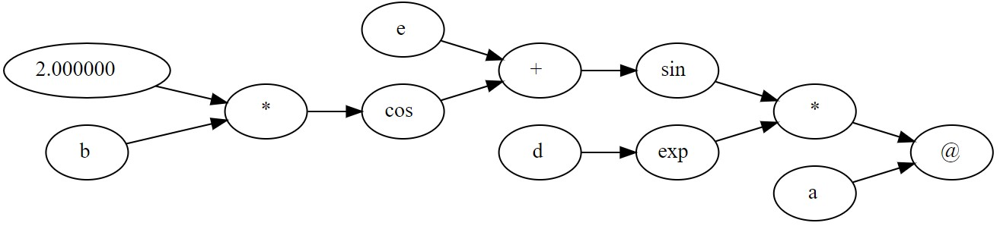

# Nabla

[](https://github.com/IITH-COMPILERS2/compilers-2-project-team-9-aug22/actions/workflows/lexer.yml) [](https://github.com/IITH-COMPILERS2/compilers-2-project-team-9-aug22/actions/workflows/parser.yml) [](https://github.com/IITH-COMPILERS2/compilers-2-project-team-9-aug22/actions/workflows/semantic.yml)


<br>

Nabla is a Domain specific langauge built for the purpose of Tensor Operations and Automatic differentiation
<br>
It uses dynamically built computational graphs for back-propagation.
<!-- Take a look at the code below -->

## Table of Contents

- [Nabla](#nabla)
  - [Table of Contents](#table-of-contents)
  - [Example](#example)
  - [Installation](#installation)
  - [Documentation](#documentation)
  - [Usage](#usage)
  - [Stages](#stages)
    - [Lexer](#lexer)
    - [Parser](#parser)
    - [Semantic Analysis](#semantic-analyzer)
    - [Transpiler](#transpilation)
  - [class Hierarchy](#class-hierarchy)
  - [Contributing](#contributing)
  - [License](#license)
  - [Acknowledgements](#acknowledgements)

## Example

```python
declare
{
    var Tensor a[2][1] = [[1],[2]];
    var Tensor b[1][2] = [[1,2]];
    var Tensor c[1][2] = [[1,2]];
    var Tensor d[1][2] = [[5,6]];
    var Tensor e[1][2] = [[53,64]];
    var Tensor g[1][2] = [[53,64]];
    var Tensor fin[1][1];
}
operations
{
    fin = sin(e+cos(2*b))*exp(d)@a;
}
gradient
{
    backward(fin);
    print(a);
    print(b);
    print(d);
    print(e);
    grad(a);
    grad(b);
    grad(d);
    grad(e);
}

```

The code will be converted into a computational graph(internally) of the form:-
After this we will be able to use the chain rule to calculate the gradients of the Final variable in terms of the beginning variables




## Installation

### Requirements

- [Make](https://www.gnu.org/software/make/)
- [Flex]()
- [Bison]()
- [g++ 9.3.0 or higher](https://gcc.gnu.org/)
- [clang++ 10.0.0 or higher](https://clang.llvm.org/)
- [Doxygen](https://www.doxygen.nl/download.html)

### Steps

1. Clone the repository

```bash
git clone https://github.com/IITH-COMPILERS2/compilers-2-project-team-9-aug22.git

```

2. Run the makefile

```bash
cd compilers-2-project-team-9-aug22
make
```
<!-- optional -->
3. Run the tests (optional) 

```bash
make test
```

<!-- 4. Install the Nabla compiler

```bash
make install 
```
-->

## Documentation

To generate the documentation for the project, run the following command in the root directory of the project

```bash
doxygen
```

The documentation for the project can be found [here](https://ganesh-rb.github.io/Nabla-documentation/)

## Stages

### [Lexer](Lexer/)

The lexer is the first stage of the compiler. It takes the input file and converts it into a stream of tokens. The tokens are then passed to the parser.

### [Parser](Parser/)

The parser is the second stage of the compiler. It takes the stream of tokens from the lexer and converts it into an Abstract Syntax Tree (AST). The AST is then passed to the semantic analyzer.

### [Semantic Analyzer](Semantic/)

The semantic analyzer is the third stage of the compiler. It takes the AST from the parser and performs semantic analysis on it. The AST is then passed to the code generator.

### [Transpilation](Transpiler/)

The transpiler is the fourth stage of the compiler. It takes the AST from the semantic analyzer and converts it into a C++ file. The C++ file is then compiled and executed.

## Class Hierarchy

---


To see the class Hierarchy please switch to the branch `AST` and see files `ast.h` and `ast.cpp`

## Testing

---

Go inside the lexer folder and run these commands to test lexer
```console
make 
make test
```

Go inside the Parser folder and run these commands to test Parser
```console
make 
make test
```

Go inside the Semantic folder and run these commands to test semantic analysis
```console
make 
make test
```

## Acknowledgements

---

- [Dr Ramakrishna Upadrasta](https://www.iith.ac.in/cse/ramakrishna) for his guidance and support


