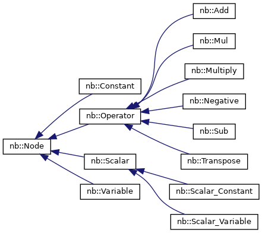

# Autodiff Engine

The autodiff engine is a library that can be used to compute derivatives of functions. 
<!-- It is designed to be used in the context of automatic differentiation, but can also be used as a general purpose derivative calculator. The autodiff engine is designed to be used in a functional style, where the gradient of a function is represented as a data structure that stores the original function and its gradient. Using this representation, we can easily manipulate the gradient using the chain rule to compute higher-order derivatives, or even use the automatic differentiation to compute derivatives of other functions. -->

## Tensor

The tensor is the basic data structure used in the autodiff engine. It is a multi-dimensional array of a particular data type (float, double, etc.). 

## Class Hierarchy

## Functality

- [x] Classes for each operator and overloaded them for different Datatypes
- [x] The datatypes for Tensor will always be a two dimensional vector
- [x] The datatypes for a Constant will always be a single constant may be a float or an integer
- [x] Create a function that will belong to the Computational graph and will create a mul node and acess its forward function.
- [ ] The _matmul function will take in two nodes and internally call tensor mult operation, while creating an operator Node.
- [ ] Support for scalar variables needs to be added.
- [ ] Support for scalar constants needs to be added.
- [ ] Support for scalar multiplication needs to be added.